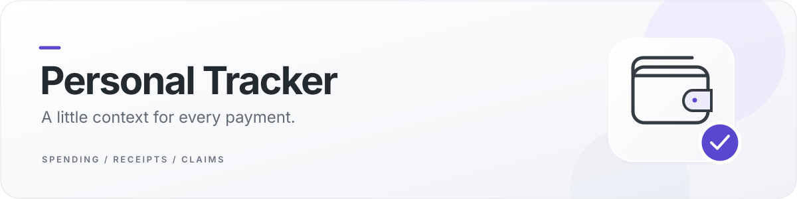

  

  Remember your spending. Organise your receipts. Prepare your claims.

  

  <strong>Android 8.0+</strong> &nbsp; · &nbsp; <strong>No account required</strong> &nbsp; · &nbsp; <strong>Records on your device</strong>

  <a href="https://github.com/vedhaS18-cyber/PersonalTracker/releases/latest">Release notes</a> &nbsp; · &nbsp;
  <a href="PRIVACY.md">Privacy</a> &nbsp; · &nbsp;
  <a href="SUPPORT.md">Help &amp; support</a>

## Every payment has a purpose

A bank alert remembers the amount. Personal Tracker helps you remember **what it was for**—lunch, a journey, groceries or something for work. Keep your personal spending and expense claims in one app, with separate records for each.

| Everyday spending | Receipts & claims |
| :--- | :--- |
| Capture recognised payment notifications from apps you select. | Collect image and PDF receipts in organised claims. |
| Add a purpose now, from a notification, or during a later review. | Scan up to 10 pages in one session, with an adjustable crop. |
| Filter by bank and review spending across Today, This month and All time. | Crop existing gallery photos; keep Original or opt into Filters. |
| Add cash payments and missed expenses manually. | Generate claim documents and keep a separate Claims backup. |

The optional scanner uses Google Play services and may download its module on first use. Ordinary camera capture and direct Gallery attachment are also available. [How scanning handles your data →](PRIVACY.md#receipt-scanning)

## Get started

1. **[Download the Android APK](https://github.com/vedhaS18-cyber/PersonalTracker/releases/download/v1.5.0/personal-tracker-v1.5.0.apk).** You don't need a GitHub account. Choose the `.apk`, not a “Source code” archive.
2. **Install and open Expense Tracker.** That's the name currently shown on your phone. If Android asks, allow installation from your browser or file manager; you can turn that permission off afterwards. Keep Play Protect enabled.
3. **Choose how to record spending.** Use manual entry, or enable notification access in Spending settings and select the apps whose payment alerts you want captured.

**Already using the app?** Install newer official versions over it. **Do not uninstall or clear storage first**—that removes local records. Back up Spending and Claims separately before changing phones. If you see an installation conflict, [read the help page](SUPPORT.md#installation-messages).

## Your records, with clear limits

- **No bank connection.** The app reads selected notifications; it does not read your SMS or email inbox or ask for your bank login.
- **Local records.** There is no app account or app server. The optional Google scanner has its own component downloads and usage/performance metrics, explained in [Privacy](PRIVACY.md).
- **You stay in control.** Review, edit, export or delete your records. Exported backups contain financial information and are not password-encrypted by this app. Keep them somewhere you trust.
- **Check important totals.** Notification alerts—including Gmail alerts—can be incomplete, delayed or missed. Compare records with your bank/card statements and add missing entries manually.

## Downloads you can verify

**Current version: v1.5.0** · Built 20 September 2026 · Publicly available since 5 October 2026

Each release includes the signed APK, its SHA-256 checksum, a verification record and accompanying third-party licence notices. [Verify your download →](docs/verification.md)

This is a GitHub-distributed build using the existing preview signing identity, with debugging disabled. It is not a Google Play release. Permanent Play Store signing and any migration plan remain separate work. The app's development repository stays private; GitHub's “Source code” archives contain this page's documentation, not the Android source.

---

**Need a hand?** [Installation help & bug reports](SUPPORT.md) · [Suggest an improvement](https://github.com/vedhaS18-cyber/PersonalTracker/issues/new/choose)

**Found a security issue?** [Report it privately](https://github.com/vedhaS18-cyber/PersonalTracker/security/advisories/new). Never post real bank alerts, receipts, account details or backups in public issues.

[Privacy & deletion](PRIVACY.md) · [Release history](CHANGELOG.md) · [Third-party notices](THIRD_PARTY_NOTICES.md) · [Publication checks](docs/publication.md)

The app source is not offered under an open-source licence by this repository. Third-party components retain their own licences and terms. Modified copies are not official updates.
